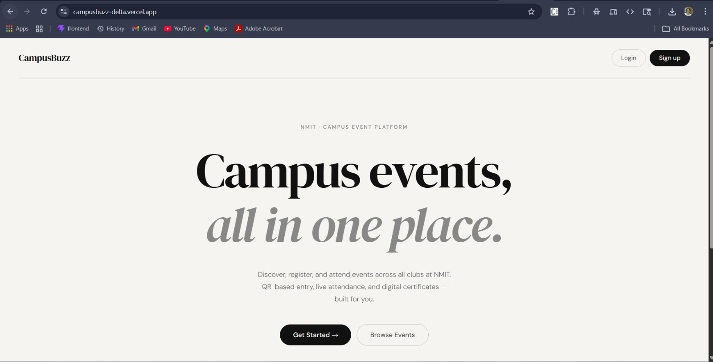
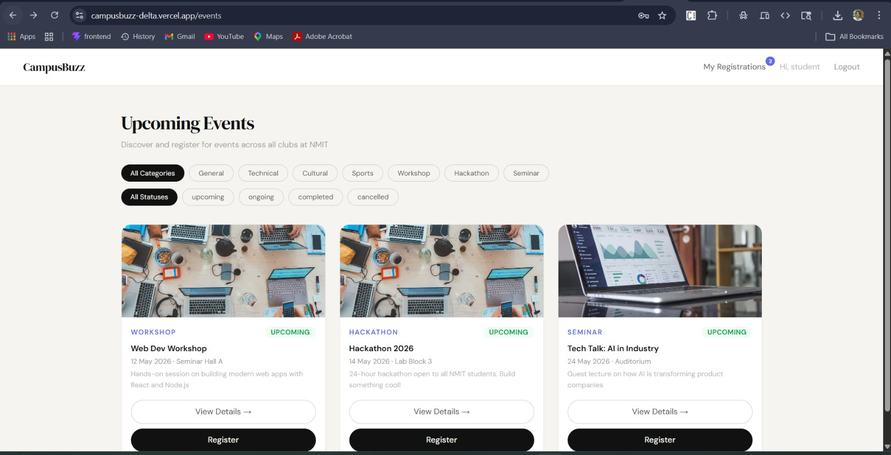
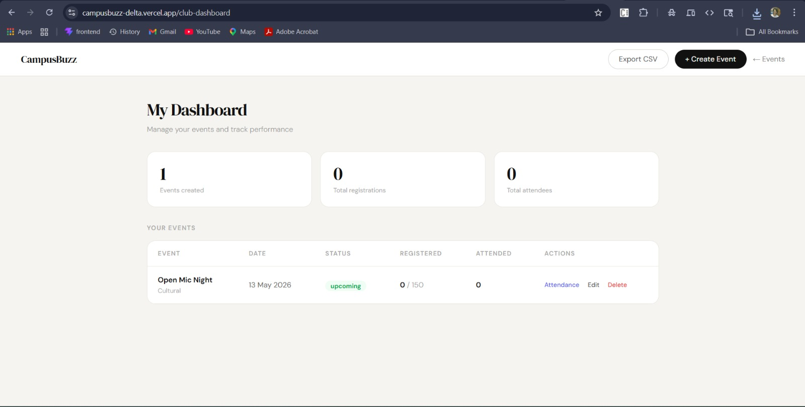
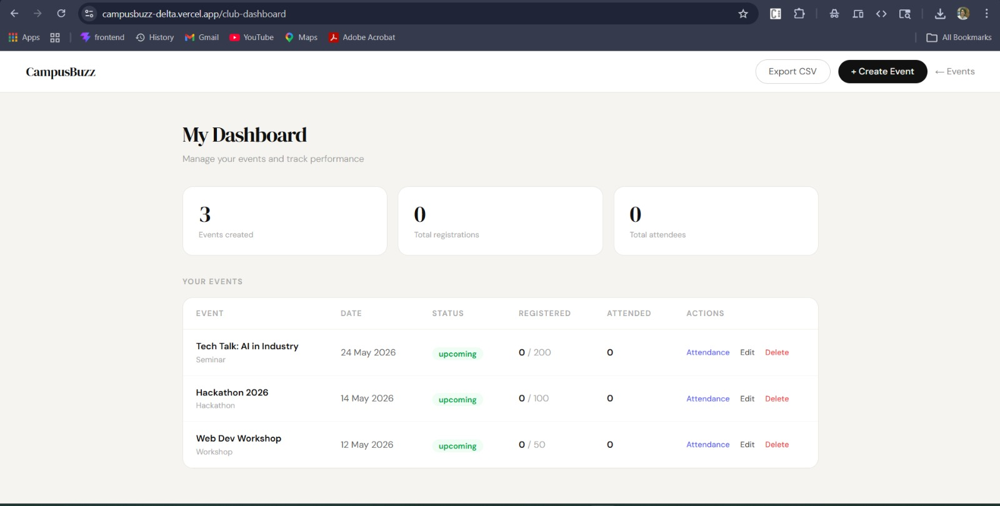

# CampusBuzz

**CampusBuzz** is a full-stack college event management platform built for NMIT. It supports three user roles — Student, Club Admin, and Super Admin — and handles everything from event creation and registration to QR-based attendance, PDF certificates, and real-time notifications.

🌐 **Live Demo:** [campusbuzz-delta.vercel.app](https://campusbuzz-delta.vercel.app)
🔧 **Backend:** [campusbuzz-jih6.onrender.com](https://campusbuzz-jih6.onrender.com)

---

## Screenshots

> Add your screenshots inside a `/screenshots` folder and they'll show up here.

| Hero Page | Events Page |
|-----------|-------------|
|  |  |

| Club Admin Dashboard | Super Admin Dashboard |
|----------------------|----------------------|
|  |  |

---

## Features

### Student
- Register with OTP-based email verification
- Browse and filter events by category and status
- Register for events and view registrations
- Download PDF attendance certificates
- Real-time notifications via Socket.io
- Editable profile (name, phone)

### Club Admin
- Create, edit, and manage club events
- Upload event banners via Cloudinary
- View registrations and scan QR codes for attendance
- Analytics dashboard with CSV export

### Super Admin
- Manage all users, clubs, and events
- Approve or reject club admin requests
- Platform-wide analytics

---

## Tech Stack

### Frontend
| Tool | Version |
|------|---------|
| React | 19 |
| Vite | 8 |
| Redux Toolkit | 2 |
| React Router DOM | 7 |
| Tailwind CSS | 4 |
| Socket.io Client | 4 |
| Axios | 1 |
| Framer Motion | 12 |
| html5-qrcode | 2 |
| react-hot-toast | 2 |

### Backend
| Tool | Version |
|------|---------|
| Node.js + Express | 5 |
| MongoDB + Mongoose | 9 |
| Socket.io | 4 |
| Cloudinary | 2 |
| PDFKit | 0.18 |
| Nodemailer | 8 |
| bcrypt | 6 |
| jsonwebtoken | 9 |
| Multer | 2 |
| qrcode | 1.5 |

---

## Folder Structure

```
campusbuzz/
├── frontend/
│   ├── public/
│   ├── src/
│   │   ├── assets/
│   │   ├── components/
│   │   │   ├── ui/
│   │   │   │   └── Skeleton.jsx
│   │   │   ├── NotificationBell.jsx
│   │   │   ├── ProtectedRoute.jsx
│   │   │   ├── QRDisplay.jsx
│   │   │   └── QRScanner.jsx
│   │   ├── pages/
│   │   │   ├── Hero.jsx
│   │   │   ├── Login.jsx
│   │   │   ├── Register.jsx
│   │   │   ├── EventsPage.jsx
│   │   │   ├── EventDetailPage.jsx
│   │   │   ├── CreateEventPage.jsx
│   │   │   ├── AttendancePage.jsx
│   │   │   ├── MyRegistrations.jsx
│   │   │   ├── ProfilePage.jsx
│   │   │   ├── ClubAdminDashboard.jsx
│   │   │   ├── AdminDashboard.jsx
│   │   │   └── NotFound.jsx
│   │   ├── redux/
│   │   │   ├── store.js
│   │   │   └── slices/authSlice.js
│   │   ├── utils/
│   │   │   ├── axios.js
│   │   │   └── useSocket.js
│   │   ├── App.jsx
│   │   └── main.jsx
│   ├── .env.example
│   └── package.json
│
└── backend/
    ├── public/temp/
    └── src/
        ├── controllers/
        │   ├── auth.controller.js
        │   ├── event.controller.js
        │   ├── registration.controller.js
        │   ├── attendance.controller.js
        │   ├── certificate.controller.js
        │   └── admin.controller.js
        ├── models/
        │   ├── user.model.js
        │   ├── event.model.js
        │   ├── registration.model.js
        │   └── pendingVerification.model.js
        ├── routes/
        │   ├── auth.routes.js
        │   ├── event.routes.js
        │   ├── registration.routes.js
        │   ├── attendance.routes.js
        │   ├── certificate.routes.js
        │   └── admin.routes.js
        ├── middlewares/
        │   ├── auth.middleware.js
        │   ├── role.middleware.js
        │   └── multer.middleware.js
        ├── utils/
        │   ├── asyncHandler.js
        │   ├── ApiError.js
        │   ├── ApiResponse.js
        │   ├── sendEmail.js
        │   ├── generateCertificate.js
        │   ├── cloudinary.js
        │   └── otp.js
        ├── db/index.js
        ├── socket.js
        ├── app.js
        └── index.js
```

---

## Local Setup

### Prerequisites
- Node.js v18+
- MongoDB Atlas account
- Cloudinary account
- Gmail account with App Password enabled

### 1. Clone the repo

```bash
git clone https://github.com/your-username/campusbuzz.git
cd campusbuzz
```

### 2. Setup Backend

```bash
cd backend
npm install
cp .env.example .env
# Fill in your .env values (see Environment Variables below)
npm run dev
```

### 3. Setup Frontend

```bash
cd frontend
npm install
cp .env.example .env
# Set VITE_API_URL to your backend URL
npm run dev
```

Frontend runs at `http://localhost:5173`
Backend runs at `http://localhost:8000`

---

## Environment Variables

### Backend `.env`

```env
PORT=8000
MONGODB_URI=mongodb+srv://<user>:<password>@cluster.mongodb.net/campusbuzz
CORS_ORIGIN=http://localhost:5173

ACCESS_TOKEN_SECRET=
ACCESS_TOKEN_EXPIRY=1d
REFRESH_TOKEN_SECRET=
REFRESH_TOKEN_EXPIRY=4d

CLOUDINARY_CLOUD_NAME=
CLOUDINARY_API_KEY=
CLOUDINARY_API_SECRET=

GMAIL_USER=
GMAIL_APP_PASSWORD=

NODE_ENV=development
```

### Frontend `.env`

```env
VITE_API_URL=http://localhost:8000
```

---

## Known Issues / Roadmap

- [ ] **OTP email on Render** — SMTP ports 465/587 are blocked on Render. Fix: migrate to Brevo SMTP (300 emails/day free, no domain needed).
- [ ] **Auto event status transitions** — cron job to move events from `upcoming → ongoing → completed` automatically. `cancelled` remains manual only.

---

## License

MIT © Deepanshu Bisht
